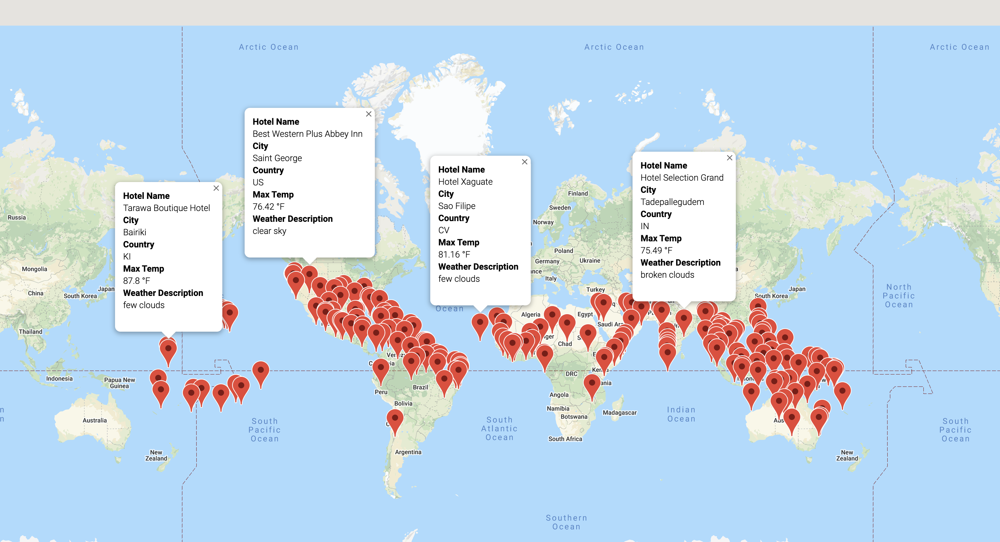
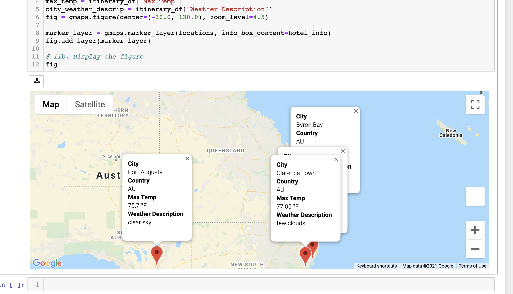
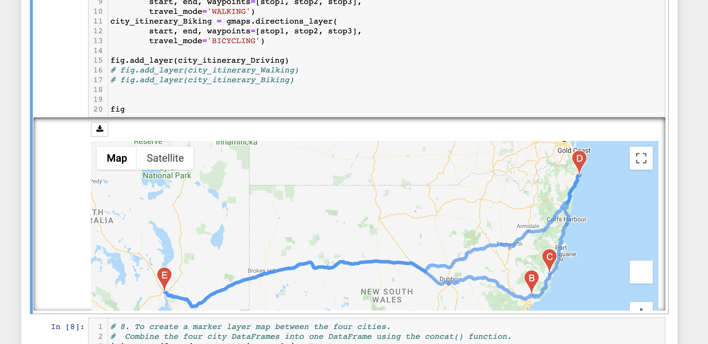

# WeatherPy_Vacation_Search
The purpose of this Activity was to create a vacation itinerary based on desired weather data input, that was then mapped for the desired destinations using. Current weather information was pulled from a weather API and location information was pulled and then mapped using a Google Maps API 

## Project Summary

In order to create a search based on specific weather criteria, first we needed to create a random sample of data points from around the globe. We created a code that pulled 2000 random latitude and longitude locations, which were then matched with nearby cities using the citiypy module. Once the cities were chosen, the current weather conditions were pulled from the OpenWeatherMap API. That information was then used as reference in the prompt to users to select a maximum and minimum desired temperature for their travel location. After the desired max and min were chosen, the cities that fit into the criteria were mapped onto a world map so that users could view and browse their options for a trip. 

For the itinerary I created, I chose four cities in Australia to use for the trip. I then created a map that displayed the four locations, their current weather conditions, and the directions for how to travel between the cities.

I created a code that could be utilized for walking, driving, or biking depending on what the user chose as their mode of travel. Based on the distance between locations that I chose in this example, I would recommend driving, though the other modes are possible with a small change to which layer is added to the map that is shown. In other itineraries, it may be more realistic to walk or bike between the locations. 

